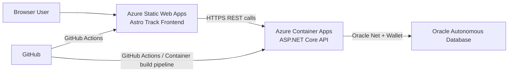

# Astro Track Frontend

Angular web client for the Astro Track astronomy management platform.

## Live Demo and Cloud Endpoints

- Live frontend (Azure Static Web Apps): https://thankful-desert-046da3c0f.7.azurestaticapps.net
- Deployed backend API (Azure Container Apps): https://astrotrack-api.jollymeadow-cbeb8eb6.canadacentral.azurecontainerapps.io
- Backend health: https://astrotrack-api.jollymeadow-cbeb8eb6.canadacentral.azurecontainerapps.io/health
- Backend database health: https://astrotrack-api.jollymeadow-cbeb8eb6.canadacentral.azurecontainerapps.io/health/database

## Related Repositories

- Frontend repository: https://github.com/Jaturaput-Jongsubcharoen/Astro-Track-Frontend
- Backend repository: https://github.com/Jaturaput-Jongsubcharoen/Astro-Track-Backend
- Oracle SQL repository: https://github.com/Jaturaput-Jongsubcharoen/Astro-Track-Oracle-SQL

## Application Features

- Browse celestial objects.
- View celestial object details.
- Create new celestial objects.
- Edit existing celestial objects.
- Delete celestial objects.
- Handle loading, empty, and error UI states.

## Supported CRUD Operations

This frontend currently implements full CRUD for Celestial Objects through the backend API:

- GET /api/celestial-objects
- GET /api/celestial-objects/{id}
- POST /api/celestial-objects
- PUT /api/celestial-objects/{id}
- DELETE /api/celestial-objects/{id}

## Frontend Technology Stack

- Angular 21 (standalone components)
- TypeScript
- Angular Router
- Angular HttpClient
- RxJS
- Karma + Jasmine unit testing
- Azure Static Web Apps for production hosting

## Production Cloud Architecture



Runtime behavior:

- Frontend serves static Angular assets from Azure Static Web Apps.
- Frontend API requests are sent to the deployed backend base URL.
- Backend handles business logic and connects to Oracle.

## API Configuration: Local vs Production

Frontend service URL resolution uses runtime config first, then environment fallback.

Local development:

- environment.ts uses /api
- Angular dev server proxy forwards /api to https://localhost:7001 via proxy.conf.json

Production build:

- environment.prod.ts points to:
	https://astrotrack-api.jollymeadow-cbeb8eb6.canadacentral.azurecontainerapps.io/api

Runtime config support:

- src/assets/runtime-config.js exists and can override apiUrl at runtime when populated.

## Local Installation and Development

Prerequisites:

- Node.js 20+ (LTS recommended)
- npm
- Running backend API at https://localhost:7001
- Trusted local ASP.NET Core HTTPS certificate

Install and run:

```powershell
cd Astro-Track-Frontend
npm ci
npm start
```

Default local app URL:

- http://localhost:4200

Main local feature route:

- http://localhost:4200/celestial-objects

## Angular Build Commands

Development build:

```powershell
npm run build -- --configuration development
```

Production build:

```powershell
npm run build
```

Output folder:

- dist/astro-track-frontend/browser

## Azure Static Web Apps and GitHub Actions Deployment

This repository includes:

- CI workflow: .github/workflows/frontend-ci.yml
- Azure Static Web Apps deployment workflow:
	.github/workflows/azure-static-web-apps-thankful-desert-046da3c0f.yml

Deployment notes:

- Push to main triggers build and deploy workflow.
- Pull requests to main trigger preview environment workflows.
- Workflow deploys built output from dist/astro-track-frontend/browser.

## Local Verification Checklist

1. Open http://localhost:4200/celestial-objects
2. Confirm list loads from backend
3. Create a new celestial object
4. Open detail page for created object
5. Edit the object and confirm changes persist
6. Delete the object and confirm it is removed

## Screenshots

No screenshot assets are currently committed in this repository.

Recommended additions:

- Home page
- Celestial object list page
- Celestial object detail page
- Create and edit form pages

## Security Notes

- This README intentionally contains no passwords, wallet files, deployment tokens, or connection secrets.
- Sensitive values must remain in secure platform settings (GitHub Secrets, Azure configuration, or local .env files that are not committed).
