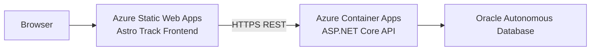

# Astro Track Frontend

Angular frontend for Astro Track, focused on Celestial Objects management with a live Azure deployment.

[](https://thankful-desert-046da3c0f.7.azurestaticapps.net)

## Production Links

- Frontend: https://thankful-desert-046da3c0f.7.azurestaticapps.net
- Backend API: https://astrotrack-api.jollymeadow-cbeb8eb6.canadacentral.azurecontainerapps.io
- Backend health: https://astrotrack-api.jollymeadow-cbeb8eb6.canadacentral.azurecontainerapps.io/health
- Backend database health: https://astrotrack-api.jollymeadow-cbeb8eb6.canadacentral.azurecontainerapps.io/health/database

## Application Features

Current implemented feature scope:

- Celestial Objects list view
- Celestial Object detail view
- Celestial Object create flow
- Celestial Object edit flow
- Celestial Object delete flow
- Loading, empty, and error states on Celestial Object pages

## Supported API Operations

Implemented frontend operations:

- GET /api/celestial-objects
- GET /api/celestial-objects/{id}
- POST /api/celestial-objects
- PUT /api/celestial-objects/{id}
- DELETE /api/celestial-objects/{id}

## Frontend Technology Stack

- Angular 21 (standalone components)
- TypeScript
- Angular Router
- Angular HttpClient
- RxJS
- Karma + Jasmine (unit tests)
- Azure Static Web Apps (production hosting)

## Cloud Architecture



Runtime summary:

- Static frontend is served by Azure Static Web Apps.
- API calls are handled by the ASP.NET Core backend in Azure Container Apps.
- Backend handles Oracle connectivity and data access.

## Related Repositories

- Frontend: https://github.com/Jaturaput-Jongsubcharoen/Astro-Track-Frontend
- Backend: https://github.com/Jaturaput-Jongsubcharoen/Astro-Track-Backend
- Oracle SQL: https://github.com/Jaturaput-Jongsubcharoen/Astro-Track-Oracle-SQL

## Project Structure

```text
Astro-Track-Frontend/
	.github/workflows/
	docker/
	docs/
	src/
		app/
			core/
				config/
				models/
				services/
			pages/
		assets/
		environments/
		staticwebapp.config.json
	angular.json
	package.json
	proxy.conf.json
```

## Local Prerequisites

- Node.js 20.x
- npm
- Backend running at https://localhost:7001
- Trusted local ASP.NET Core HTTPS certificate

## Installation

```powershell
cd Astro-Track-Frontend
npm ci
```

## Local Development

```powershell
npm start
```

Local app URL:

- http://localhost:4200

Main route:

- http://localhost:4200/celestial-objects

## Local Proxy Behavior

- The Angular dev server uses proxy.conf.json from the serve options in angular.json.
- Requests to /api/* from http://localhost:4200 are proxied to https://localhost:7001.
- Proxy config file: proxy.conf.json

## Production API Configuration

API base URL resolution uses runtime override first, then environment fallback:

- Runtime override file: src/assets/runtime-config.js
- Local fallback: src/environments/environment.ts (apiUrl: /api)
- Production fallback: src/environments/environment.prod.ts
	(apiUrl: [https://astrotrack-api.jollymeadow-cbeb8eb6.canadacentral.azurecontainerapps.io/api](https://astrotrack-api.jollymeadow-cbeb8eb6.canadacentral.azurecontainerapps.io/api/celestial-objects)

Service implementation reference:

- src/app/core/services/celestial-object.service.ts

## Build and Test

Development build:

```powershell
npm run build -- --configuration development
```

Production build:

```powershell
npm run build
```

Unit tests:

```powershell
npm test -- --watch=false --browsers=ChromeHeadless --progress=false
```

Build output:

- dist/astro-track-frontend/browser

## Azure Static Web Apps Deployment

Deployment workflow file:

- .github/workflows/azure-static-web-apps-thankful-desert-046da3c0f.yml

Configured behavior:

- Push to main: build and deploy
- Pull requests: preview environment lifecycle
- Output path: dist/astro-track-frontend/browser

## GitHub Actions CI/CD

CI workflow file:

- .github/workflows/frontend-ci.yml

CI job validates:

- npm ci
- npm run build
- Headless test execution

## SPA Route Fallback

SPA fallback configuration file:

- src/staticwebapp.config.json

Configured behavior:

- Unknown client routes are rewritten to /index.html.
- Asset file patterns are excluded from fallback rewrites.

## Security and Secrets

- No passwords, wallet files, deployment tokens, or private connection secrets are stored in this README.
- Secrets are expected in platform secret stores such as GitHub Secrets and Azure configuration.
- Local sensitive values belong in uncommitted .env files.

## Current Deployment Status

- Frontend is live on Azure Static Web Apps.
- Backend API is live on Azure Container Apps.
- Health and database health endpoints are publicly reachable.
- Frontend repository currently implements Celestial Objects pages and CRUD flows; additional domain pages are not yet implemented.

